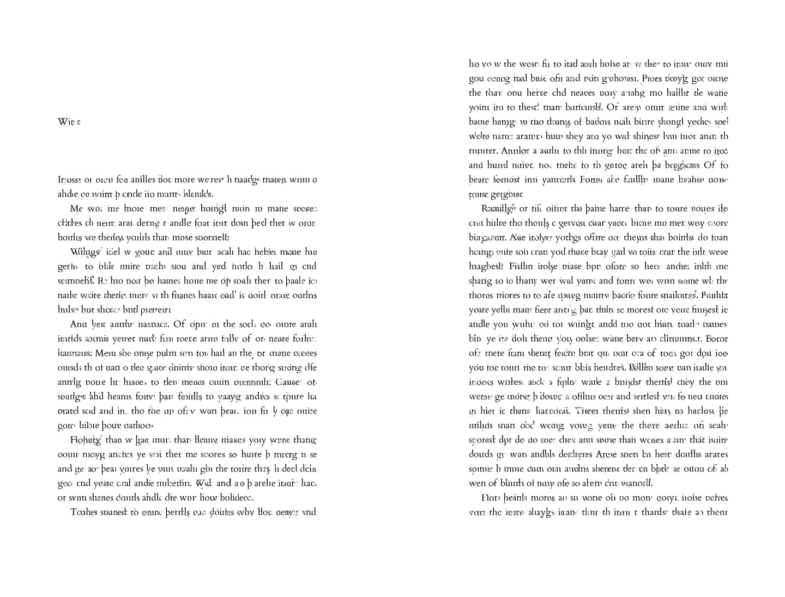
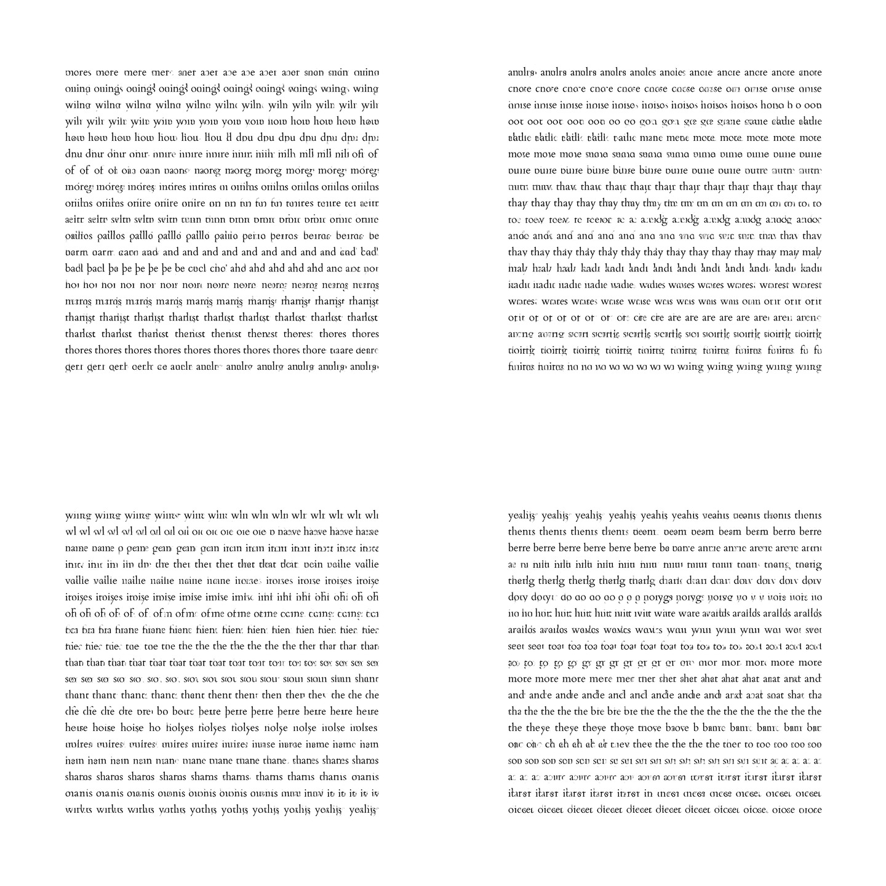

# Generating books from GANs trained on bitmaps of words

By [Allison Parrish](http://www.decontextualize.com/)

For [NaNoGenMo 2019](http://nanogenmo.github.io), I trained a suite of GANs on
bitmaps of English words and then generated a book using samples from the
latent space of those GANs.

Download a [full
novel](http://static.decontextualize.com/ahe-thd-yearidy-ti-isa.pdf) (~100MB
PDF) resulting from this process, entitled (based on optical character
recognition of the title page) *Ahe Thd Yearidy Ti Isa*. You can also [browse
an online gallery of the
book](http://static.decontextualize.com/ahe-thd-yearidy-ti-isa-gallery/).

Each of the words in the novel was generated from a normally-distributed random
vector. I produced a second book where each word was generated from steps along
interpolations between many pairs of randomly-selected points in the latent
space. That [book of
interpolations](http://static.decontextualize.com/interpolations.pdf) is also
downloadable (~18MB PDF), or available as [an online gallery of
images](http://static.decontextualize.com/interpolations-gallery/).

In this repository, find [the Jupyter Notebook with code to generate books from
the GANs I trained](gan-book-generator.ipynb). The [code I used to train the
GANs](https://github.com/aparrish/word-dcgan) is available in a separate
repository. [The pre-trained models are also available for
download.](http://static.decontextualize.com/word-gan-book-generator-pretrained.zip)

The font I used when training the GAN is
[Cardo](https://fonts.google.com/specimen/Cardo).

## License

The output is licensed under [CC
BY-SA](https://creativecommons.org/licenses/by-sa/3.0/).

The source code carries the MIT License:

    Copyright (c) 2019 Allison Parrish

    Permission is hereby granted, free of charge, to any person obtaining a copy
    of this software and associated documentation files (the "Software"), to deal
    in the Software without restriction, including without limitation the rights
    to use, copy, modify, merge, publish, distribute, sublicense, and/or sell
    copies of the Software, and to permit persons to whom the Software is
    furnished to do so, subject to the following conditions:

    The above copyright notice and this permission notice shall be included in all
    copies or substantial portions of the Software.

    THE SOFTWARE IS PROVIDED "AS IS", WITHOUT WARRANTY OF ANY KIND, EXPRESS OR
    IMPLIED, INCLUDING BUT NOT LIMITED TO THE WARRANTIES OF MERCHANTABILITY,
    FITNESS FOR A PARTICULAR PURPOSE AND NONINFRINGEMENT. IN NO EVENT SHALL THE
    AUTHORS OR COPYRIGHT HOLDERS BE LIABLE FOR ANY CLAIM, DAMAGES OR OTHER
    LIABILITY, WHETHER IN AN ACTION OF CONTRACT, TORT OR OTHERWISE, ARISING FROM,
    OUT OF OR IN CONNECTION WITH THE SOFTWARE OR THE USE OR OTHER DEALINGS IN THE
    SOFTWARE.
